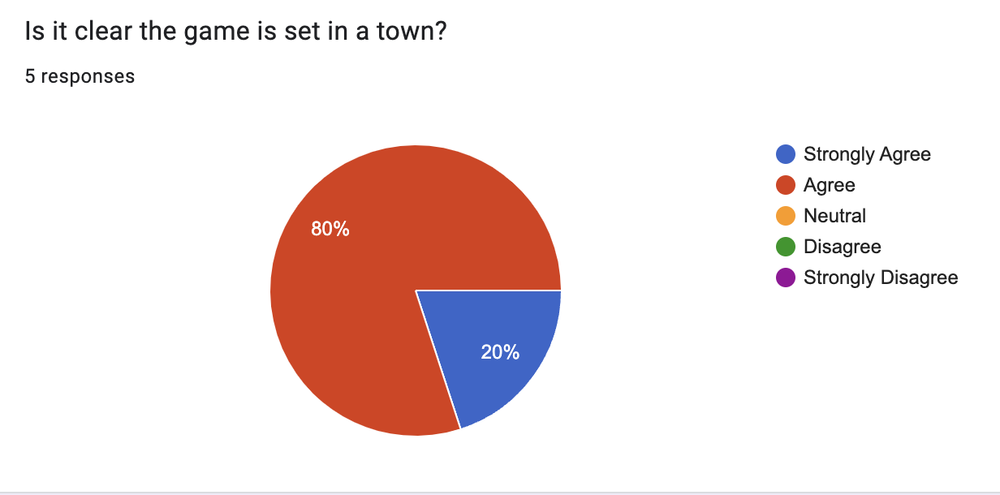

# 1.2 Stakeholders

## Customer Role

## Demographics

20% of gamers in the US are under 18 and 34% are between the ages of 18 and 34 which shows that the majority of people who play video games are younger as between 35 and 44 years their is only 14% of the US's gamers([Clement, 2021](../reference-list-stakeholders.md)).  US video game sales show that the most popular type of game is action at 26.9% of game sales and the fifth most popular is adventure with 7.9% of game sales in the US([Clement, 2017](../reference-list-stakeholders.md)).  PEGI(Pan European game information) is the system adopted by Europe to age rate video games including both difficulty and inclusion of violent content, as my game will include zombie characters which the player will be required to fight I believe the game will fall into the 12 category as it is violence against a human looking fantasy character, but as the game is 2D and will contain unrealistic depictions of the violence I think it will not go into the 16 category([PEGI, 2017](../reference-list-stakeholders.md))

This shows that it will take advantage of the largest demographics as it will not be too childish and therefore capture the biggest audience of 18 to 34 year-olds but will also be able to be marketed to the majority of the market of 18 and under([Clement, 2021](../reference-list-stakeholders.md)).
